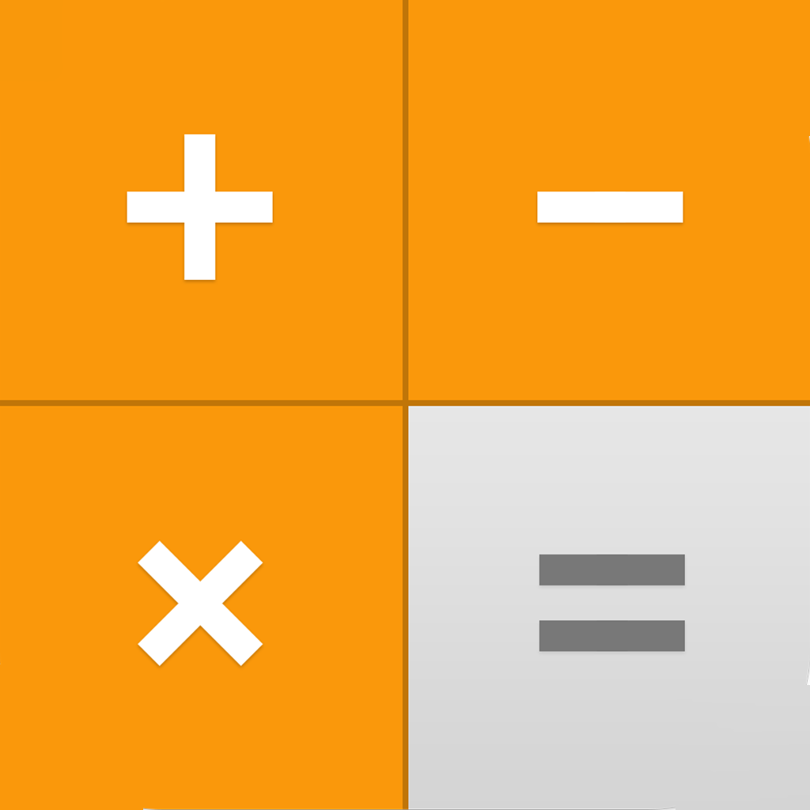

# Calendar Application

This is a fully functioning scientific calculator written in flutter.
It is optimized for the **iPad** dimensions and supports resizable windows.
If you experience any technical bugs, submit them via the button in the settings.
If you experience maleformed equations or even mathematical errors, please use the built-in bug report button.

## Demo

https://user-images.githubusercontent.com/35542741/208095305-b9422dad-9b1c-49f4-95ea-f9120a9516d2.mp4

## Features

- Resizable
- Works on iOS, iPadOS, Web & (untested) Android
- Intuitive to use
- Lot's of functionality

## Good to know

1. The factorial for decimal numbers is approximated by the gamma function from Srinivasa Ramanujanea.
2. The precision is 64bits.

## Getting Started

Either download the app from the appstore, or build the flutter project yourself.

1. Clone the repo
2. `flutter build ios`

**If you want to contribute, feel free!**
